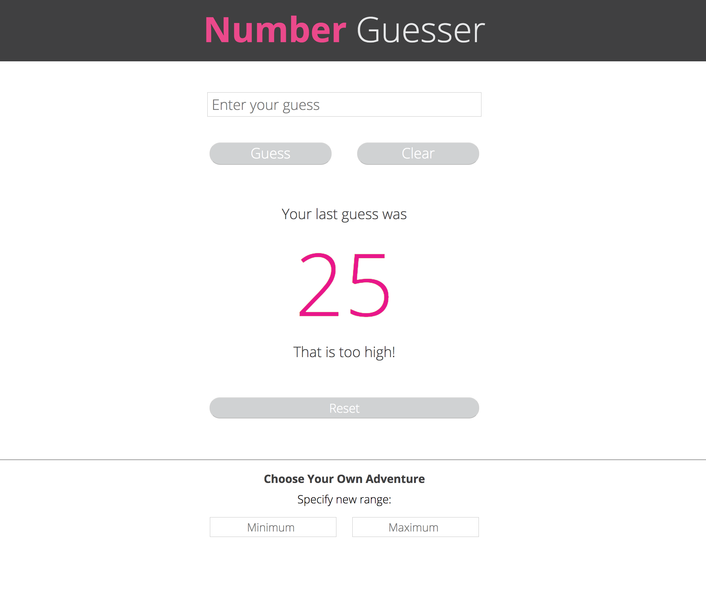

# Number Guesser 

## Synopsis

Number Guesser is a game that generates a random number between 0-100 and allows the user to guess the number until they get it right. The game will tell you if you are too high, too low, or spot on. Users can also specify their own number range. 

### *Inspiration:* 

**Turing School of Software & Design Front-End Engineering Project - Mod 1:** [Number Guesser Project Spec](http://frontend.turing.io/projects/number-guesser.html)

### *Screenshots* 

